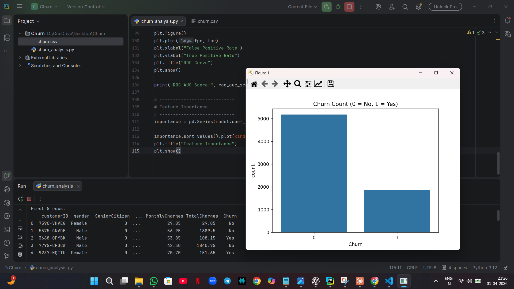
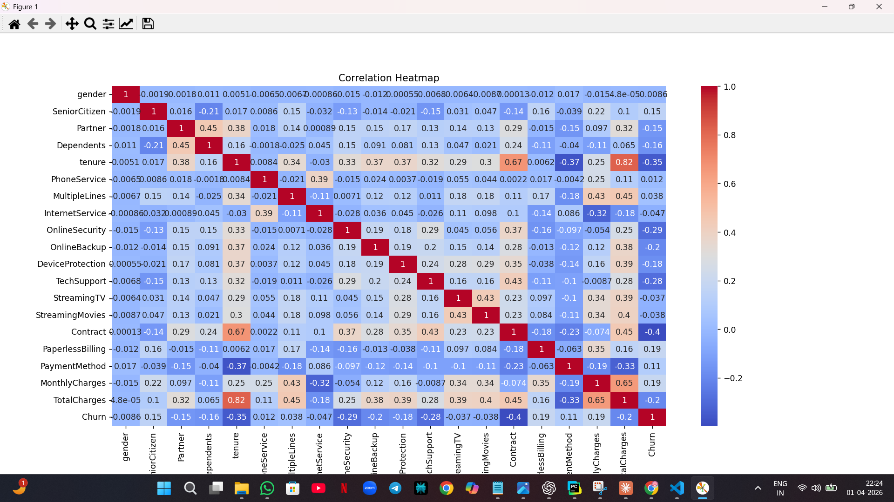
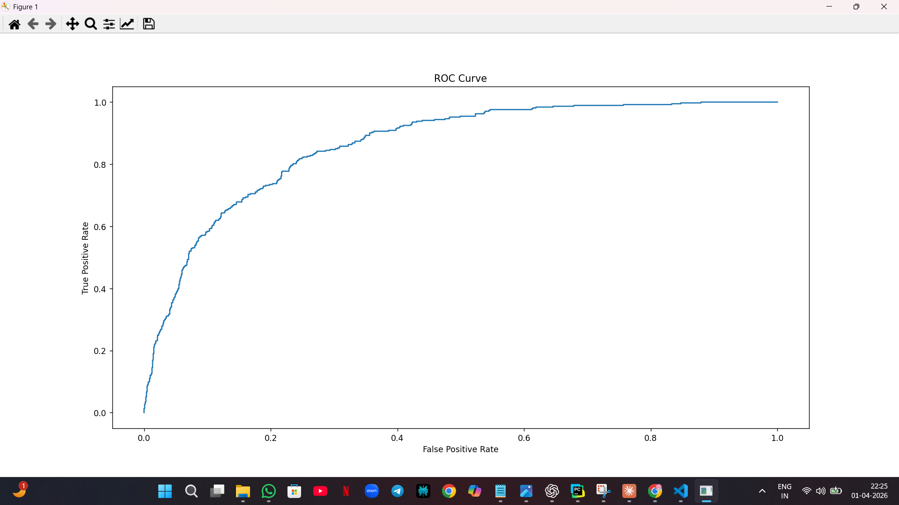
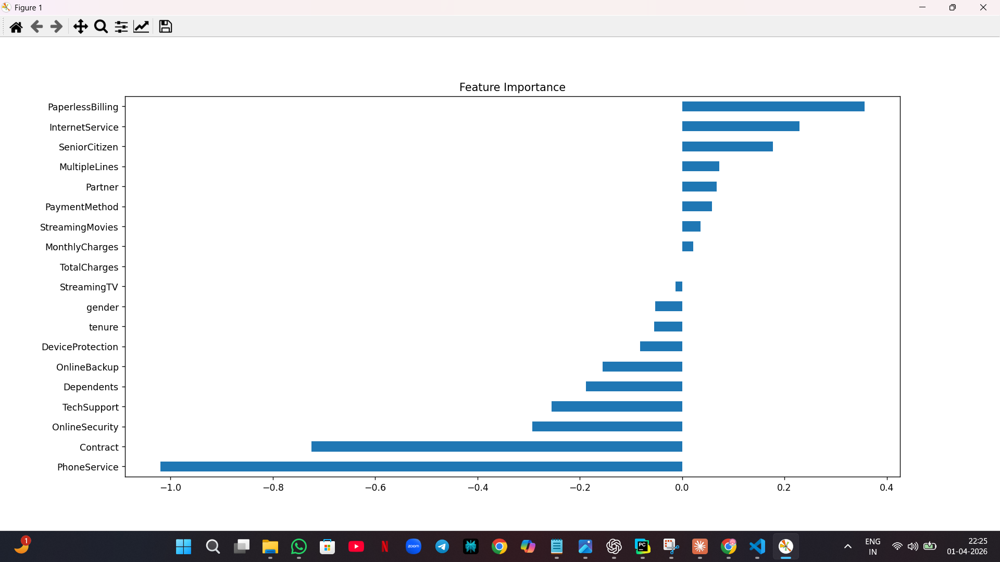

# Customer-Churn-Prediction
This project predicts customer churn using machine learning techniques. It includes data preprocessing, exploratory data analysis (EDA), visualization, and classification models to identify customers likely to leave a service.
# Customer Churn Prediction using Machine Learning

## 📌 Project Overview
This project focuses on predicting customer churn using machine learning techniques. Customer churn refers to when customers stop using a company's services. By analyzing customer data, this model helps identify customers who are likely to leave, enabling businesses to take preventive actions.

---

## 🎯 Objectives
- Predict whether a customer will churn or not
- Perform data preprocessing and cleaning
- Conduct Exploratory Data Analysis (EDA)
- Build and evaluate a machine learning model
- Visualize important insights from the data

---

## 🛠️ Technologies Used
- Python
- Pandas
- NumPy
- Matplotlib
- Seaborn
- Scikit-learn

---

## 📊 Dataset
The dataset contains customer information such as:
- Demographics
- Account information
- Service usage
- Billing details

Target variable:
- **Churn (0 = No, 1 = Yes)**

---

## ⚙️ Project Workflow
1. Data Loading  
2. Data Cleaning & Preprocessing  
3. Exploratory Data Analysis (EDA)  
4. Feature Encoding  
5. Model Building (Logistic Regression)  
6. Model Evaluation  
7. Visualization  

---

## 📈 Model Performance
- Accuracy: ~80% (approx)
- Evaluation Metrics:
  - Confusion Matrix
  - Classification Report
  - ROC Curve

---

## 📷 Visualizations

### 🔹 Churn Distribution

### 🔹 Correlation Heatmap

### 🔹 ROC Curve

### 🔹 Feature Importance

---

## 🚀 Future Improvements
- Use advanced models (Random Forest, XGBoost)
- Hyperparameter tuning
- Deploy as a web application
- Real-time prediction system

---

## 📎 Project Link
👉 https://github.com/Fauqiya/Customer-Churn-Prediction

---

## 👩‍💻 Author
**Fauqiya**

---
